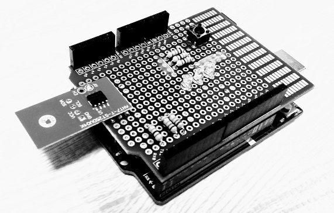

# Arduino with dynamic NFC tag



Let's make an interactive digital photo frame with dynamic NFC tag!

## Motivation

My PC has been broken, and it will take a few weeks to get my PC repaired.

I use this time to make an interactive digital photo frame based on RasPi and Arduino.

## Note

This is a remake of [another project that have used ST25DV04K with STM32](https://github.com/araobp/stm32-mcu/tree/master/NUCLEO-F401RE/NFC).

## Parts

- RasPi
- Arduino UNO
- ST25DV04K dynamic NFC tag
- Capacitor sensor
- LEDs

## Test code

[Test code](./arduino/)

When I hold my smart phone over the tag, it opens the URL with Chrome browser automatically!

```
ST25 system config: 88 3 1 0 C 7 0 E C F 0 0 0 0 7 0 0 0 0 0 7F 0 3 24 AF F 62 2 0 24 2 E0 
ST25 password: 0 0 0 0 0 0 0 0 
ST25 dynamic config: 88 FF 8 0 1 0 0 0 
NDEF CC file: E1 40 40 0 
NDEF message type: 3 
NDEF message length: 3A 
NDEF header: D1 1 36 55 
NDEF payload length: 55 
NDEF Identifier code: 4 
NDEF URI field:
github.com/araobp/pic16f1-mcu/bl
ob/master/BLINKERS.md
```
## NDEF format for URI(HTTPS)

```
+---------------+
|     0xE1      | CC File 4 bytes length
+---------------+ 
|     0x40      | CC File
+---------------+
|     0x40      | CC File
+---------------+
|     0x00      | CC File
+---------------+
|     0x03      | Meaning that this tag contains NDEF records.
+---------------+
|Payload len + 4| NDEF Head 4 bytes (short record, no ID)
+---------------+
|1|1|0|1|0|0|0|1| MB(1), ME(1), CF(0), SR(1), IL(0), TNF(001)
+---------------+
|     0x01      | Type length
+---------------+
|Payload length |
+---------------+
|    0x55 ('U') | Type: URI
+---------------+
|     0x04      | Identifier code: HTTPS
+---------------+
|     URL       | Payload
|      :        |
|      :        |
+---------------+
```
